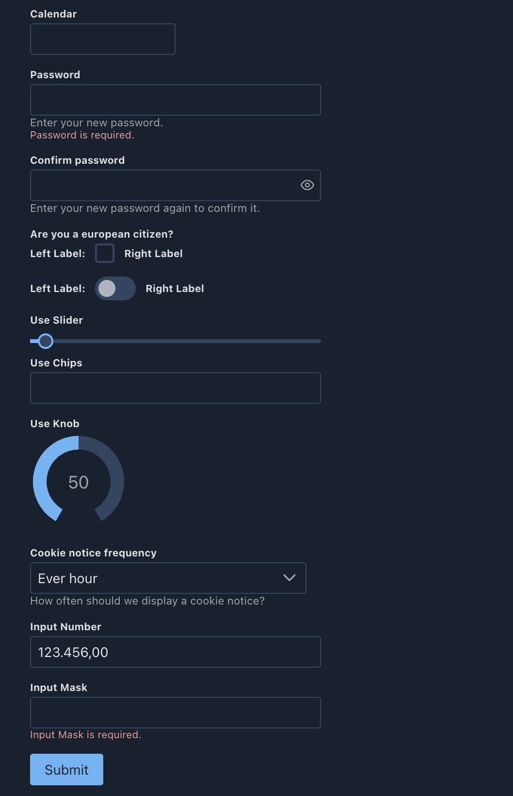

# Formkit - Primevue

Helper classes for using [Formkit](https://formkit.com/) with the [PrimeVue UI Framework](https://www.primefaces.org/primevue/#/)

## Docs

[Docs](https://sfxcode.github.io/formkit-primevue/)

[Demo/Playground](https://formkit-primevue.netlify.app/)

## Usage

```typescript

import { defaultConfig, plugin } from '@formkit/vue'
import { primeInputs } from '@sfxcode/formkit-primevue'


  app.use(plugin, defaultConfig({
    locales: { de, en },
    // Define the active locale
    locale: 'en',
    inputs: primeInputs,
  }))
```

### Basic Styling

Basic styling is provided with the **formkit-primevue.scss** file.

Features:

- Width of all text and dropdown elements is set to 100%
- Error Color by variable (--formkit-error-color)
- Some margins, font sizes ...

You can use it or take it as base for your own styling.

### Extended Styling

- All inputs are wrapped in a div with a **p-formkit** class
- Most Prime Components have access to class / styles attributes
- PT and PTOptions are available ([https://primevue.org/passthrough/](https://primevue.org/passthrough/))
- [Styling](https://formkit-primevue.netlify.app/demo/styling), [Grid](https://formkit-primevue.netlify.app/demo/grid) and [PT](https://formkit-primevue.netlify.app/demo/passThrough) demo available

## Showcases

[Demo Application](https://formkit-primevue.netlify.app/)

[Nuxt 3 PrimeVue Starter](https://github.com/sfxcode/nuxt3-primevue-starter) and [Vite PrimeVue Starter](https://github.com/sfxcode/vite-primevue-starter) with Formkit support available.

## Supported Inputs

- Calendar
- Checkbox
- Dropdown
- Editor (HTML Editor)
- InputMask
- InputNumber
- InputSwitch
- InputText
- InputTextarea
- MultiSelect
- Password
- Ranking
- Chips
- Knob
- ColorPicker
- Listbox
- ToggleButton
- SelectButton
- TriStateCheckbox
- RadioButton




